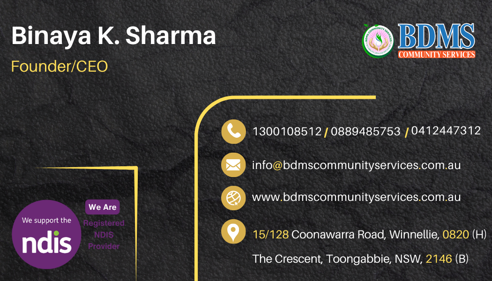

# Welcome to my profile !

[Download Company Brochure](New_Brochure_Bdms_12_2024.pdf)

<!-- Other content of the README -->

# Binaya Kumar Sharma
## Founder & Director, 
# BDMS Community Services

📍 Darwin (NT) | Sydney (NSW)  
📞 1300 108 512 | 08 89485753 | 0422683338   ✉️ info@bdmscommunityservices.com 

---

## Connect with Me

- [LinkedIn](https://linkedin.com/in/binay-kumar-sharma-1545539a/)
- [YouTube](https://youtube.com/@bdmscommunityservices8981)
- [Facebook](https://www.facebook.com/BDMSCSNSW)

---

## Message From CEO

Dear Friends & Partners,

At BDMS Community Services, our values – Quality, Choice, Control, Equality, Respect, and Dignity – aren’t just ideas. They’re the heartbeat of everything we do.

Since 2019, we’ve been honored to support the Darwin and Palmerston communities. This year, we’re thrilled to bring our services to Sydney too – because everyone, everywhere, deserves care that empowers them.

As an NDIS-registered provider, we focus on personalized support for people with mental and physical disabilities. Our team is specially trained to work with participants with high behavioral needs (BOC), and we never compromise on compassion.

To our stakeholders: Thank you for walking this journey with us. Together, we’re creating a world where dignity isn’t a privilege – it’s a promise.

With gratitude,
Binaya Kumar Sharma,
Founder & Director,
BDMS Community Services.

---
## Visit our Website
www.bdmscommunityservices.com.au

